# 🚗2023ESWContest_mobility_명장_6056

## 🕵️‍♀️T-VAR(Traffic signal Violation Automatic Reporting system)
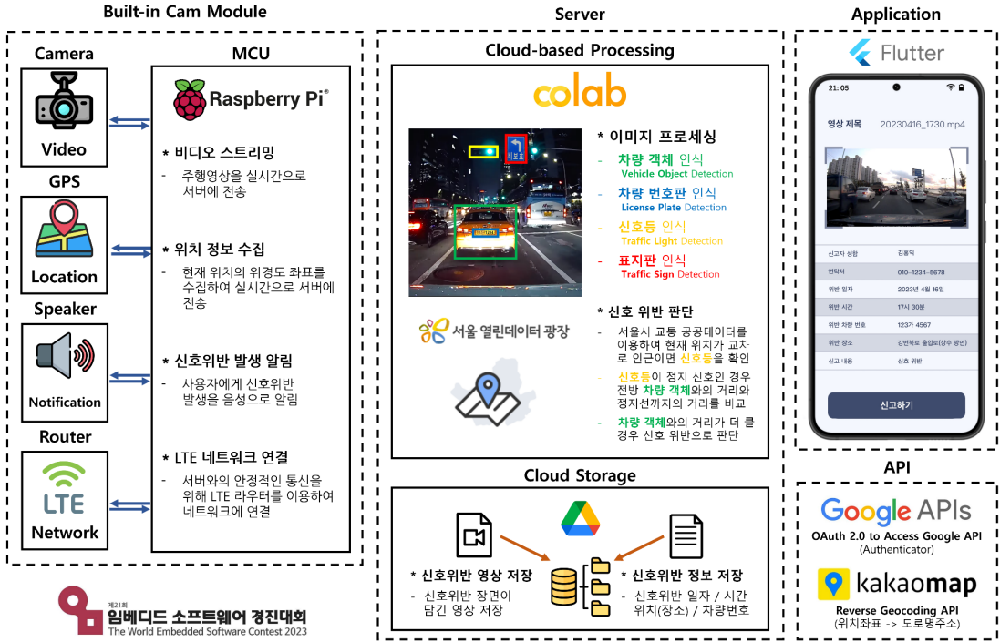

### 📜작품 소개
T-VAR는 차량 내 빌트인 캠을 활용한 신호 위반 자동 단속 시스템으로, 빌트인 캠의 영상과 라즈베리파이, GPS 센서를 이용한다.
앞 차량을 빌트인 캠의 영상정 및 GPS 정보를 이용해 거리를 측정하고, 현재 내 위치로부터 신호등까지의 거리와 비교해 신호 위반을 판단한다.
최종적으로 신호 위반으로 판단된 정보를 서버에 저장 및 Application으로 전송해 자동으로 양식을 완성해 준다.

# 목차
• 🎥시연 영상 
• 💁‍♂️팀 소개 및 역할 
• 📌영역별 소개 
• 📁파일 구성도 
• 👨‍💻영역별 개발 환경 
• 🔍각 영역별 구성도 
• 🛠️HW 설계

## 🎥시연영상

https://myoungjang.site/youtube

## 💁‍♂️팀 소개 및 역할
| Position    | Name&nbsp;&nbsp;   | GitHub | Email | Role |
|:-------------:|:--------:|--------|-------|------|
| **Team Leader** | 김영휘 | https://github.com/dudgnl5209| dudgnl5209@naver.com| • 기획 및 개발 총괄 • 웹 스트리밍 통신 구현 • 위반 데이터 저장소 관리 • Reverse Geocoding 통합 처리 • 공공 데이터 수집 및 가공     |
| **Team member** | 김우주 | https://github.com/pupukii   | wj3507@naver.com    | • 객체 추적 모델 설계 및 구현 • Image Processing • 신호 위반 판단 Logic 구현 • 신호 위반 관련 법규 분석     |
| **Team member** | 신유재 | https://github.com/Uj710     | yujae710@naver.com  | • Server 통신 관리 • Application 개발 • UI디자인 • 저장소와 Application 간의 통신 개발     |
| **Team member** | 한현준 | https://github.com/barlide   | alqp201@gmail.com   | • 객체 추적 모델 설계 및 구현 • Image Processing • 신호 위반 판단 Logic 구현 • 위반 데이터 후처리     |
| **Team member** | 오준혁 | https://github.com/hulalahu| stephan330@naver.com| • Custom data 학습 파일 생성 • 공공 데이터 수집 및 가공 • 모듈 Case 설계 및 안전성 검증 • 데이터 증강 알고리즘 개발     |

## 📌영역별 소개
1. Built-in Cam Module : 상시 촬영을 진행하며, 신호등과의 거리가 50m 안으로 들어올 때부터 서버에 실시간으로 영상 스트림을 진행한다.
2. Server : 실시간으로 전송받은 영상 정보에 객체 인식을 진행하고 현재 내 위치로부터 앞 차량까지의 거리, 서울시 공공데이터를 기준으로 정지선과 현재 내 위치까지의 거리를 비교해 통해신호 위반 판단을 진행한다.
3. Cloud Storage : 신호 위반 판단으로 판정날 경우 차번호, 위반날짜, 위반 위치, 위반 항목을 txt파일로 저장하고, 이에 해당하는 위반 영상을 같이 저장 및 관리한다. 
( 이때 저장소는 48시간이 넘은 데이터는 자동으로 삭제하도록 한다) 
4. Application : 사용자가 Application에 로그인 하여 저장된 정보들을 리스트로 확인 할 수 있다. 신호 위반이라 판단된 정보를 확인할 수 있고, 원하는 경우 자동으로 양식을 생성 및 신고 기능을 지원한다.
5. API : 위치 좌표를 Reverse Geocoding을 이용해 도로명 주소로 바꿔준다.

## 📁파일 구성도
----------------
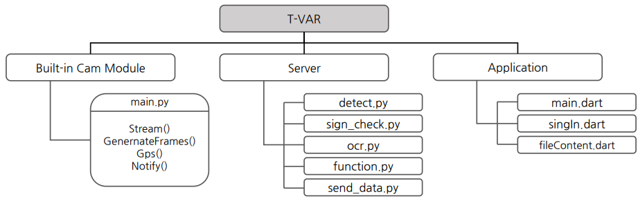

## 👨‍💻영역별 개발 환경
--------------------
#### 1. 📷Built-in-Cam
>###### OS

>###### Language

>###### Framework
 

#### 2. 🛜Server
>###### IDE

>###### Language

>###### Framework
   

#### 3. Application
>###### IDE

>###### Language

>###### Framework

>###### API
 

## 🔍각 영역별 구성도
#### 📷Built - in Cam Module 구성

#### 🛜Server 구성 및 상황별 판단 Logic
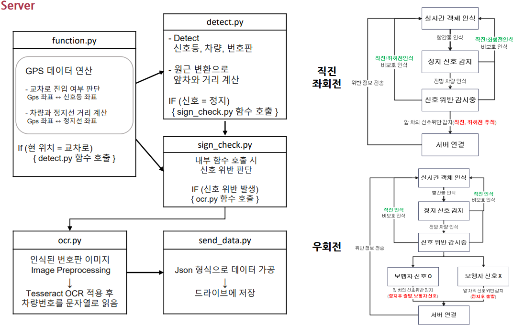

#### 📱Application 구성
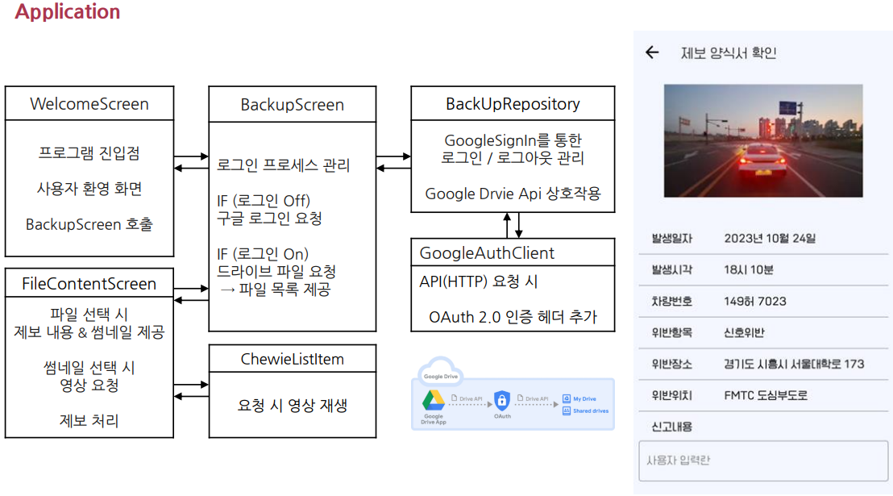

#### 📲Application UI Guide
**• Application의 대기 화면(홍익대 마스코드 와우)**  
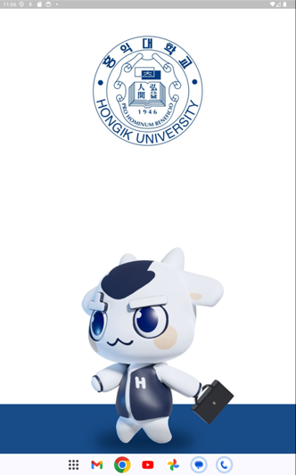  

**• Application의 로그인 화면**  
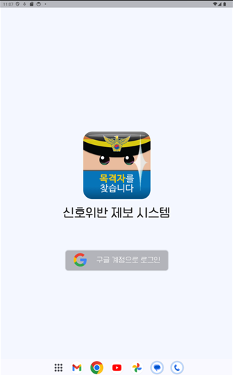  

**• Google계정으로 로그인 후, 로그인된 아이디로 Google drive 연동**  
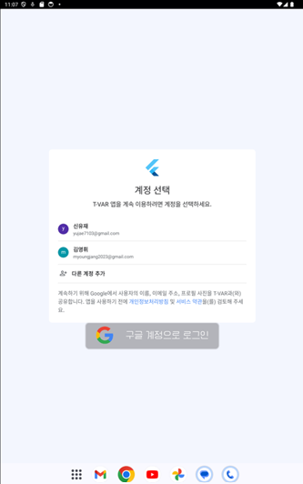  

**• Google drive에 저장된 신호 위반 목록을 불러와 리스트로 보여줌**  
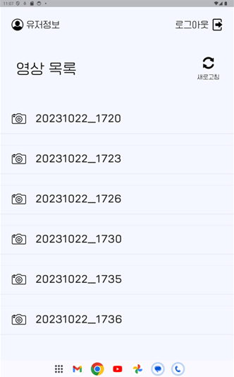  

**• 신호 위반 리스트 중, 원하는 항목 선택시 제보양식서를 생성**  
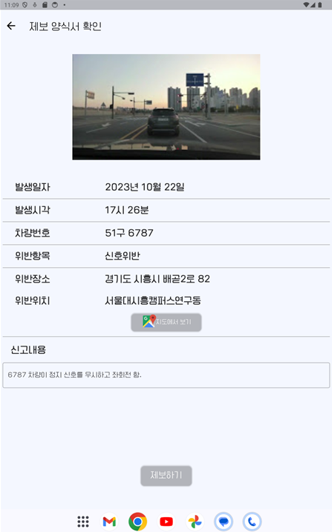  

**• 신호 위반 리스트의 구글 맵 클릭시 아래와 같이 위치 좌표 확인 가능**  
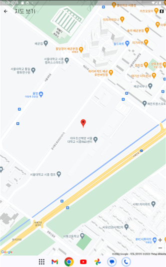  

## 🛠️HW 설계
목적 : T-VAR 시스템에 맞는 자체적인 HW 제작 진행
### 설계 사양 및 사용 Tool 
• 3D Modeling Tool  : **Simens NX 10.0** 
• Matterial : PLA  
• Size : 358 * 241 * 60 (mm) 
• Weight :(<1000g)

### HW 구성 및 기능
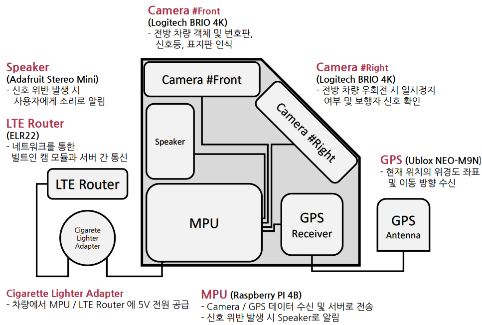

### Modeling File 및 실제 제품
1. Assembly File 
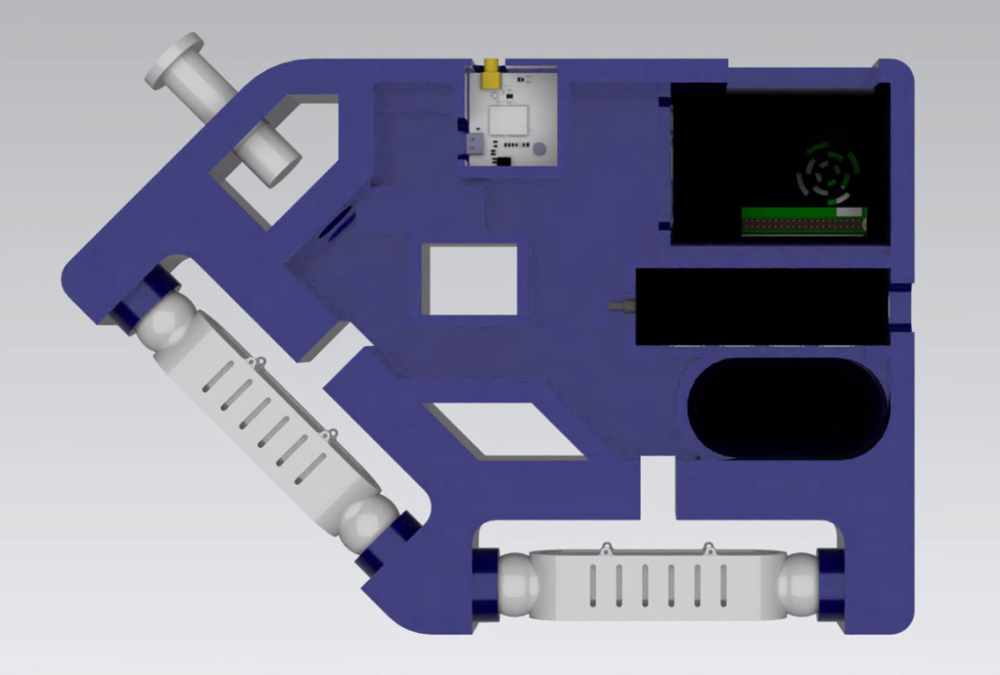 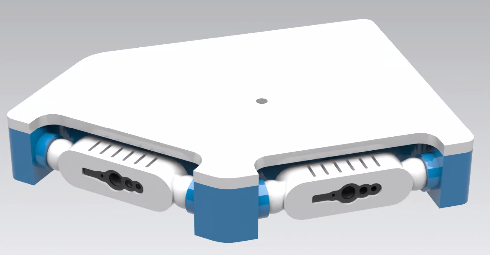

2. 실제 제품

